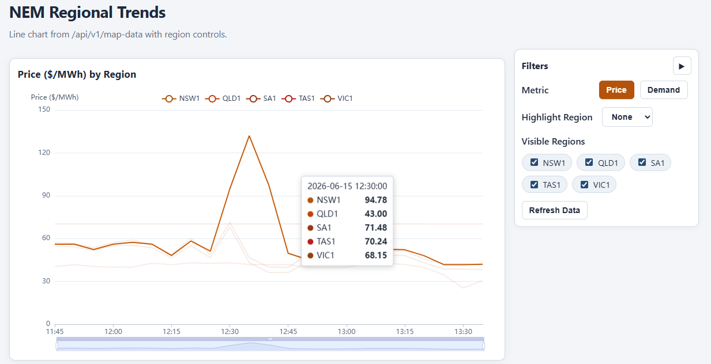
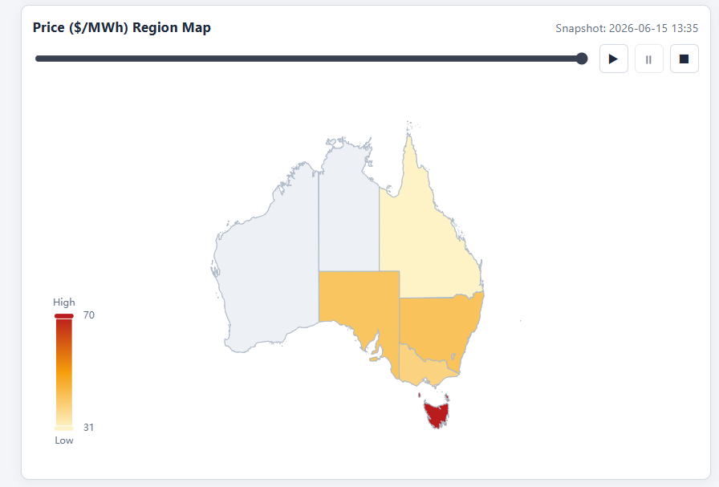
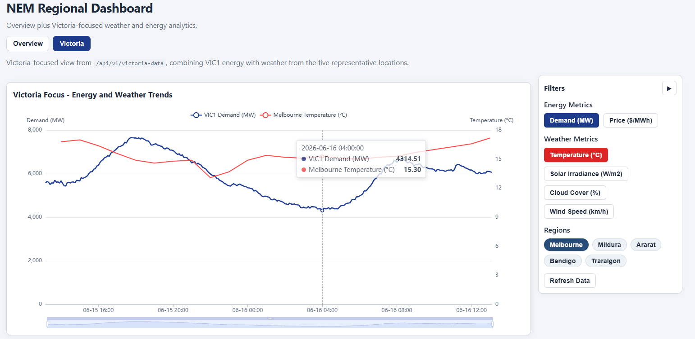
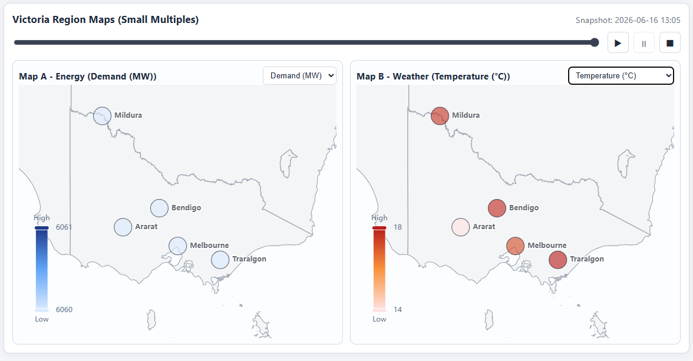

# Portfolio Project Plan: Autonomous Microgrid Energy Arbitrage Agent

## 1. Project Overview

**Objective:** To build an autonomous, serverless Agentic AI system that orchestrates a home battery storage strategy by analyzing real-time wholesale electricity prices, forecasting weather-dependent solar generation, and reasoning through physical battery constraints.

**Use Case:** Residential energy arbitrage for wholesale-exposed electricity customers (e.g., Amber Electric in Australia). The Agent acts as an automated energy broker, replacing brittle heuristic timers with dynamic, predictive reasoning to minimize retail costs and maximize grid export profits during market anomalies.

**Portfolio Impact (Measurable Achievements):** This project is designed to be presented on a resume as a series of measurable achievements, such as: *"Engineered a serverless AI agent reducing simulated annual energy costs by X% compared to baseline heuristics, utilizing xLSTM for 24-hour demand forecasting and LangGraph for autonomous execution."*

---

## 2. Progressive Execution Phases

This project follows an agile, progressively enhanced architecture where the frontend and backend evolve simultaneously.

### Phase 1: Data Ingestion & The Observability Foundation
**Description:** Sourcing the raw data and building the initial visual pipeline to prove the data engineering works.
* **Backend Outcomes:** * Clean, synchronized time-series datasets combining weather (Open-Meteo) and wholesale pricing (Amber API / OpenNEM).
  * Handling of Australian timezones (AEST/AEDT) and missing temporal data.
* **Frontend Outcomes (UI Stage 1):** * A geospatial map of the Australian National Electricity Market (NEM) regions showing live demand.
  * A time-series line chart tracking historical wholesale spot prices ($/MWh) alongside local solar irradiance.
* **Language / Stack:** Python, Pandas, Streamlit or React, Jupyter Notebooks for EDA.

**Phase 1 Progress Update (Implemented):**
* **Backend Completed:** FastAPI endpoints are live in `src/main.py`:
  * `/api/v1/market-data` for merged weather + market records
  * `/api/v1/map-data` for recent NEM regional price/demand time-series (sparse points forward-filled per region instead of zero-filled)
  * `/api/v1/victoria-data` for VIC1 energy plus weather across five representative Victorian locations
  * Data pipeline is DataFrame-first internally, JSON at API boundary for frontend consumption.
* **Timezone & Data Quality Handling:**
  * Weather and energy timestamps are standardized to `Australia/Melbourne` (energy is tz-aware AEST `+10:00`; weather is fetched in local time and localized to match).
  * Open-Meteo "latest 24 hours" clipping trims the archive API's future-dated, whole-day padding so data never extends past now.
* **Shared Configuration:**
  * `src/config/locations.py` defines `VICTORIA_WEATHER_LOCATIONS` (Melbourne, Mildura, Ararat, Bendigo, Traralgon) as the single source of truth, chosen to span demand, solar, and wind drivers across Victoria's renewable energy zones.
* **API Clients Completed:**
  * `src/api_clients/pricing_api.py` returns DataFrames for market/network/regional demand use cases.
  * `src/api_clients/open_meteo.py` supports raw payload, standardized DataFrame helper, latest-24h clipping, and batched multi-location fetch (one API call, tidy per-region rows).
* **Frontend Completed (`frontend/v1_observability`):**
  * React + Vite + TypeScript + ECharts app scaffolded and connected to backend APIs.
  * Two sections behind a top tab nav: **Overview** (default) and **Victoria**.
  * **Overview:** Multi-region line chart with controls (metric toggle `price`/`demand`, region visibility as buttons, highlight region, manual refresh) and a real Australia map view (state polygons) with timeline slider and playback controls (run/pause/stop).
  * **Victoria:** Combined energy + weather line chart with three filter groups (energy metrics, weather metrics, regions) and dual-axis support; small-multiple maps (Map A energy, Map B weather) rendering equal-size region bubbles over a neutral warm-gray Australia base map zoomed to Victoria, driven by a shared timeframe slider.
  * Right-side collapsible filter panel and latest data timestamp display on both sections.

*Overview section:*



*Victoria section:*


### Phase 2: Forecasting Model & The Predictive Overlay
**Description:** Building the predictive engine and overlaying its accuracy against baselines on the dashboard.
* **Backend Outcomes:** * A trained deep learning model generating a 24-hour multi-variate forecast.
  * **Note:** Use advanced architectures like xLSTM (configured explicitly *without* the deprecated `backend` argument) or Temporal Fusion Transformers (TFT).
  * SHAP integration for Explainable AI (XAI) feature importance.
* **Frontend Outcomes (UI Stage 2):** * A "Look-Ahead" toggle added to the dashboard.
  * The chart now overlays four distinct paths: The Model's Forecast, the Actual Spot Price, a Naive Baseline (persistence), and the Industry Norm (Default Market Offer).
* **Language / Stack:** Python, PyTorch / Darts, SHAP.

**Phase 2 Progress Update (In Progress):**

*Forecasting target (defined):*
  * Primary prediction: **VIC1 spot price** over the next **24 hours** at **30-minute** resolution (48 steps).
  * Inputs: past market data (price, demand, renewables, interconnector flow) + future weather forecast covariates + calendar features.
  * Baseline ladder planned: persistence → seasonal naive → XGBoost → xLSTM/TFT.

*Historical training data pipelines (implemented):*
  * **Energy (`src/fetch_energy_history.py`):** Chunked 2-year backfill (default 7-day chunks), CLI (`--days`, `--chunk-days`, `--regions`), per-region validation, and CI-friendly exit codes. Pulls VIC1 + adjacent regions (NSW1, SA1) via `src/api_clients/pricing_api.py`.
  * **Energy client improvements (`src/api_clients/pricing_api.py`):** Date-range fetch methods, real `interconnector_flow_mw` from OpenElectricity `FLOW_IMPORTS`/`FLOW_EXPORTS`, and Melbourne-local datetime normalization for API compatibility.
  * **Actual weather (`src/fetch_weather_history.py`):** Chunked archive pulls with clip-to-now (avoids future-hour padding), multi-region support (`--all-vic-regions`), validation, and CLI exit codes.
  * **Forecast weather (`src/fetch_weather_forecast_history.py`):** Historical forecast backfill via Open-Meteo **Previous Runs API** (`--lead-days 1` ≈ 24h ahead) and live snapshot append mode (`--mode snapshot`). Supports all five VIC regions.
  * **Open-Meteo client (`src/api_clients/open_meteo.py`):** `get_historical_forecast_df()` (Previous Runs), `get_live_forecast_snapshot_df()` (live forecast API with `forecast_hours`), plus existing archive and multi-location helpers.
  * **Unified weather schema (`src/config/weather_schema.py`):** Canonical columns for actual + forecast rows (`region`, `timestamp`, `forecast_issue_time`, `lead_hours`, `record_type`, `source`, weather features). Shared chunking, clipping, validation, and location resolution.
  * **Modeling table builder (`src/build_weather_training_table.py`):** Merges aligned actual + forecast CSVs into `data/processed/weather_modeling_vic.csv` and reports the modeling overlap window.

*Raw datasets produced (example commands):*
```bash
python src/fetch_energy_history.py --days 730 --chunk-days 7
python src/fetch_weather_history.py --all-vic-regions --days 730 --chunk-days 30
python src/fetch_weather_forecast_history.py --mode historical --all-vic-regions --days 730 --chunk-days 30 --lead-days 1
python src/build_weather_training_table.py --days 730 --lead-days 1
```

*Key output files (`data/raw/` and `data/processed/`):*
  * `market_{REGION}_730d.csv` — energy actuals (5-min), per NEM region
  * `weather_actual_vic_730d.csv` — actual weather, 5 VIC regions, hourly
  * `weather_forecast_history_vic_730d_lead1d.csv` — historical forecasts with issue-time semantics
  * `weather_forecast_snapshots_vic.csv` — append-only live forecast snapshots (snapshot mode)
  * `weather_modeling_vic.csv` — combined actual + forecast table for model training

*Still to do (core Phase 2 deliverables):*
  * Train/evaluate baseline + xLSTM/TFT price forecast models in `notebooks/02_xlstm_forecasting.ipynb` / `src/models/`.
  * Walk-forward validation and arbitrage-relevant metrics (peak/trough MAE, simulated battery P&L).
  * SHAP feature importance for forecast explainability.
  * Frontend `v2_predictive` look-ahead overlay (model vs actual vs naive vs DMO reference).

### Phase 3: Autonomous Orchestrator & The Command Center
**Description:** Prototyping the cognitive agent that binds forecasts, live data, and physical constraints, making it visible to the user.
* **Backend Outcomes:** * A functioning agentic loop (Perception $\rightarrow$ Reasoning $\rightarrow$ Action) that invokes the forecasting model as a tool.
  * System prompts defining the mathematical objective function and battery state-of-charge limits.
* **Frontend Outcomes (UI Stage 3):** * An interactive **Agent Execution Trace** console streaming the agent's real-time inner monologue (`Thought` $\rightarrow$ `Tool Call` $\rightarrow$ `Action`).
  * A dynamic visual representing the battery's current State of Charge (SoC).
  * An active ROI scorecard tracking cumulative dollar savings vs. a standard heuristic.
* **Language / Stack:** Python, LangChain/LangGraph, OpenAI/Anthropic API.

### Phase 4: Backend Modularization & Testing
**Description:** Refactoring notebook experiments into a production-ready, object-oriented backend.
* **Outcomes:** * Clean codebase organized by domain (`api_clients`, `models`, `agent_core`).
  * Error handling for API rate limits and robust logging mechanisms.
* **Language / Stack:** Python, Pytest.

### Phase 5: Serverless Cloud Deployment
**Description:** Moving the system to a fully autonomous, event-driven cloud architecture.
* **Outcomes:** * A serverless deployment running on a strict 30-minute cron schedule without manual intervention.
  * Infrastructure deployed and managed directly via **AWS CloudFormation (Console-based deployment)** for exact reproducibility.
* **Language / Stack:** AWS Lambda, Amazon EventBridge, Amazon DynamoDB, AWS CloudFormation.

---

## 3. Aligned Folder Structure (Current + Planned)
```text
energy-arbitrage/
│
├── config/
│   ├── settings.yaml           # House parameters (battery capacity, location)
│   └── prompt_templates/       # Agent persona and constraints
│
├── data/
│   ├── raw/                    # Raw JSON/CSV dumps
│   └── processed/              # Cleaned datasets
│
├── docs/
│   └── images/                 # README screenshots/assets
│       ├── dashboard-line-chart.png
│       └── dashboard-map-view.png
│
├── infrastructure/
│   └── cloudformation.yaml     # AWS IaC template (deployed via console)
│
├── notebooks/                  
│   ├── 01_data_exploration.ipynb
│   ├── 02_xlstm_forecasting.ipynb  # xLSTM setup (no backend arg)
│   └── 03_agent_reasoning.ipynb
│
├── scripts/                    # One-off utilities
│   └── generate_vic_regions.py # Builds Victoria sub-region polygons (Voronoi)
│
├── src/                        # Modularized Python Backend
│   ├── models/                 # PyTorch/xLSTM architectures
│   ├── agent/                  # LLM orchestration and tools
│   ├── config/
│   │   ├── locations.py        # VICTORIA_WEATHER_LOCATIONS constants
│   │   └── weather_schema.py   # Canonical weather export schema + validation helpers
│   ├── api_clients/
│   │   ├── open_meteo.py
│   │   ├── pricing_api.py
│   │   └── testing.py
│   ├── fetch_weather_history.py
│   ├── fetch_weather_forecast_history.py
│   ├── build_weather_training_table.py
│   ├── fetch_energy_history.py
│   └── main.py                 # FastAPI app
│
├── frontend/                   # Progressive Web Visualization
│   └── v1_observability/       # Implemented: Overview + Victoria dashboard
│   │   ├── src/
│   │   │   ├── api/
│   │   │   │   ├── mapData.ts
│   │   │   │   └── victoriaData.ts
│   │   │   ├── assets/
│   │   │   │   └── vic_regions.geojson
│   │   │   ├── components/
│   │   │   │   ├── MapDataLineChart.tsx
│   │   │   │   ├── MapDataRegionMap.tsx
│   │   │   │   ├── OverviewSection.tsx
│   │   │   │   ├── VictoriaSection.tsx
│   │   │   │   ├── VictoriaLineChart.tsx
│   │   │   │   └── VictoriaRegionMap.tsx
│   │   │   ├── constants/
│   │   │   │   └── victoriaRegions.ts
│   │   │   ├── theme/
│   │   │   │   └── metricTheme.ts
│   │   │   ├── App.tsx
│   │   │   ├── App.css
│   │   │   ├── index.css
│   │   │   └── main.tsx
│   │   └── package.json
│   ├── v2_predictive/          # Forecast overlays
│   └── v3_command_center/      # Agent trace & ROI scorecard
│
├── tests/                      # Planned pytest suite
├── GEMINI.md                   # Optional AI workflow notes
├── environment.yaml            # Conda environment spec
├── .env.example                # API keys template
├── .gitignore
└── README.md
```